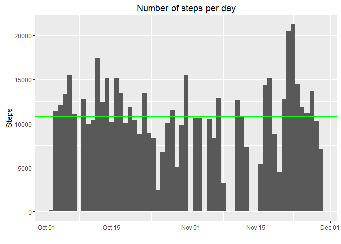
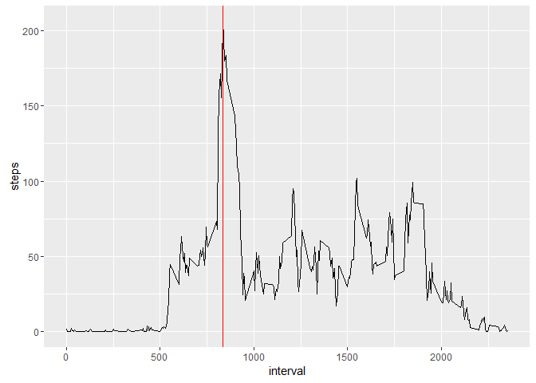
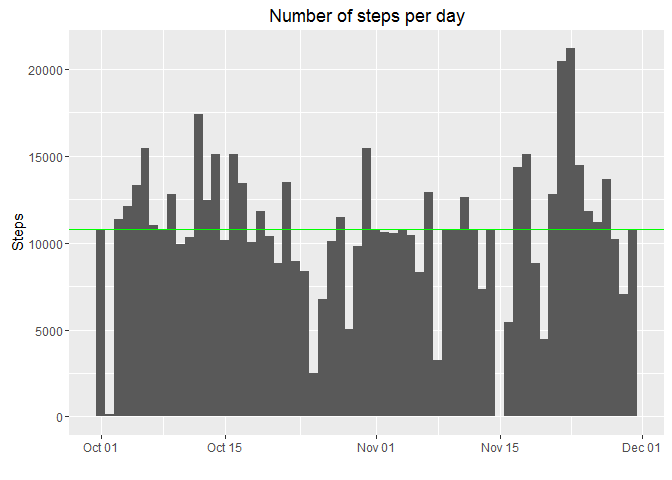

# Reproducible Research: Peer Assessment 1


## Loading and preprocessing the data
To load the dataset we'll use the following **R code**: 


```r
require(ggplot2)  
```

```
## Loading required package: ggplot2
```

```r
options(scipen = 2)  
if(!file.exists("activity.csv")) { unzip("activity.zip") }  
activity <- read.csv("activity.csv")  
```
This will load the dataset in the data.frame _activity_

## What is the mean total number of steps taken per day?
Given the dataset, we can calculate the number of steps per day and plot it with an histogram. A green line will be plotted to show the mean. The following code will do just that:

```r
steps_by_day <- aggregate(steps~date, activity, sum, na.rm=TRUE)  
g<-ggplot(steps_by_day, aes(as.Date(date)))  
g+geom_histogram(aes(weight=steps), binwidth=length(date)) +  
  geom_hline(yintercept = mean(steps_by_day$steps), colour = "green") +
  labs(x="", y="Steps", title="Number of steps per day")
```



The mean and the median of the total number of steps (rounded to 2 decimal places ) are calculated as:  
  
- mean steps  : 10766.19  - round(mean(steps_by_day$steps),2)  
- median steps: 10765 - round(median(steps_by_day$steps),2)  


## What is the average daily activity pattern?
To calculate the average daily pattern, we'll generate a time series plot of the 5-minute interval (along the x-axis) and the average number of steps taken. The code to accomplish this is:

```r
steps_by_interval <- aggregate(steps~interval, activity, mean, na.rm=TRUE)
g<-ggplot(steps_by_interval, aes(interval,steps))
g+geom_line()+
  geom_vline(xintercept = steps_by_interval[which(steps_by_interval$steps == max(steps_by_interval$steps)),"interval"], colour = "red")
```


  
The vertical intercept shows the 5-minute interval which contains the maximum number of steps: 835, which contains an average of 206.17 steps (rounded to 2 decimals).  

## Imputing missing values
The dataset contains 2304 _missing values_. Since these can bias the results, we'll fill in all the missing values with the mean for that 5-minute interval. The procedure looks as follow:  
1.Calculate and report the total number of missing values in the dataset (i.e. the total number of rows with NAs)  
2.Filling in all of the missing values in the dataset with the mean for the corresponding 5-minute interval  
3.Create a new dataset that is equal to the original dataset but with the missing data filled in.  


The code is:  

```r
sum(is.na(activity$steps))
```

```
## [1] 2304
```

```r
activity_complete <- activity

for(i in 1:length(activity$steps)) {
# HERE
	if(is.na(activity_complete[i,"steps"])) {
	  corresponding_mean <- steps_by_interval[which(steps_by_interval$interval == activity_complete[i,"interval"]),"steps"]
	  activity_complete[i,"steps"] <- corresponding_mean}
}
```

After running the code there are 0, which is what we want. So now we plot the total number of steps again. We see that the median has changed.  It looks like the missing values are not relevant for the calculation of hte mean value, but are important for the calculation of the median.


```r
steps_by_day <- aggregate(steps~date, activity_complete, sum, na.rm=TRUE)  
g<-ggplot(steps_by_day, aes(as.Date(date)))  
g+geom_histogram(aes(weight=steps), binwidth=length(date)) +  
  geom_hline(yintercept = mean(steps_by_day$steps), colour = "green") +
  labs(x="", y="Steps", title="Number of steps per day")
```



Again the green line shows the mean value. The mean and the median of the total number of steps (rounded to 2 decimal places ) are re-calculated as:  
  
- mean steps  : 10766.19  - round(mean(steps_by_day$steps),2)  
- median steps: 10766.19 - round(median(steps_by_day$steps),2)  


## Are there differences in activity patterns between weekdays and weekends?
This last part focus on the differences between weekdays and weekends. We will add a column to our dataset, indicating if the measurement has taken place in the weekend or in the weekdays.


```r
activity_complete$day <- "weekday"
activity_complete$day[weekdays(as.Date(activity_complete$date)) == "Saturday"] <- "weekend"
activity_complete$day[weekdays(as.Date(activity_complete$date)) == "Sunday"] <- "weekend"
```

Now we can make a panel plot contaaining a time series plot of the 5-minute interval (x-axis) and the average number of steps taken, averaged across all weekday days or weekend days (y-axis).   

```r
library(lattice)
steps_by_interval_day<-aggregate(steps~interval+day, activity_complete, mean)  
 xyplot(steps~interval|day, data=steps_by_interval_day, type="l", layout=c(1,2))  
```


  
By looking at the plots, it appears that the average steps peaks earlier in the morning during weekdays.
